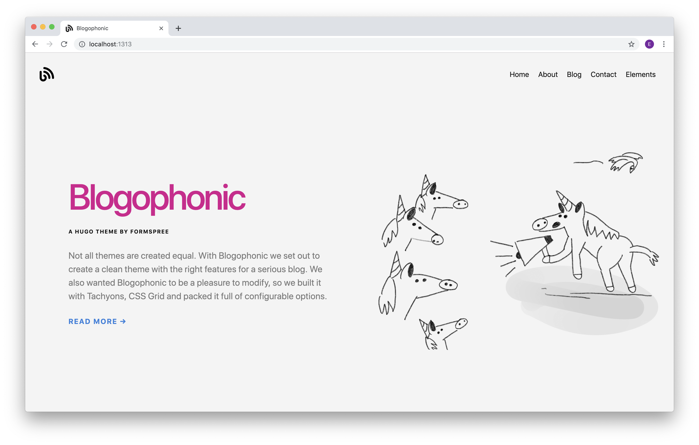

# _Blogophonic_ - a blog theme for Hugo by [Formspree](https://formspree.io)

A modern, beautiful, and easily configurable blog for Hugo that includes a dedicated page with a functional contact form.

**See the demo [here](https://blogophonic-hugo.netlify.com)**



## Three Reasons to Use Blogophonic

1. **Blogophonic is thoughtfully crafted** with features a blog _should have_: multiple layouts - including one with a sidebar; custom sidebar text with a sticky ad container; option to hide byline, dateline, and thumbnail images.

2. **Styled with Tachyons** - A design system for todays modern, generated websites. Avoid complex cascades and unintended side effects while taking advantage of Tachyons community library of components.

3. **Forms Built-in** - Collect inquiries fast and easy with a contact form powered by Formspree ... you don't need a server or any programming knowledge. Just configure the form page and submit once to set it up.

## Usage

> NOTE: blogophonic-hugo-theme requires the `extended` version of hugo, since it relies on hugo's built-in SASS processor. As of Jan 11, 2021 `hugo-extended` is installed by default when running `brew install` however, for windows or linux users, you must ensure you've installed the extended version. Please see https://gohugo.io/getting-started/installing/.

Unlike the original Blogophonic template, this **is** a hugo theme. To use it, add it as a submodule to your `themes` directory:

```
git submodule add https://github.com/JeffreyPalmer/blogophonic-hugo-theme.git themes/blogophonic-hugo-theme
```

Once you have added the theme as a submodule, take a look at the example `config.toml` in `themes/blogophonic-hugo-theme/exampleSite` to get an idea of how to configure things.

**Caveat:** Most of the changes I've made (and am making) to this theme are to scratch personal itches. I'm not a theme designer, so if you choose to use this theme you'll be somewhat on your own.

## Site Configuration

The following site configuration options are found in the `config.toml` file at the root of the `exampleSite` Hugo site.

### Font Options

Blogophonic uses Tachyons to render beautiful system font stacks for your site, making it super simple to configure and _blazing fast_ to load. The default choices are `sans-serif` or `serif`, and can be assigned to headings and body text respectively. Additional options can be found in the [Tachyons Font Family Reference](http://tachyons.io/docs/typography/font-family/).

```toml
textFontFamily = "sans-serif"
headingFontFamily = "sans-serif"
```

### Basic Color Options

Again, relying on Tachyons, Blogophonic provides many different color combinations that you can mix and match to your hearts content. The defaults are shown here, with many more available by browsing the [Tachyons Color Palette](http://tachyons.io/docs/themes/skins/). **Note:** Color names _must_ match exactly, the color name found in the reference page linked above.

```toml
siteBgColor = "near-white"
sidebarBgColor = "light-gray"
headlineColor = "dark-pink"
headingColor = "near-black"
textColor = "dark-gray"
sidebarTextColor = "mid-gray"
bodyLinkColor = "blue"
navLinkColor = "near-black"
sidebarLinkColor = "near-black"
footerTextColor = "silver"
buttonTextColor = "near-white"
buttonBgColor = "black"
buttonHoverTextColor = "white"
buttonHoverBgColor = "blue"
borderColor = "moon-gray"
```

### Social Icons

There are three places where you can choose to show social icons: header, footer, and contact page. Header and footer options are found in site config (`config.toml`) alongside the social accounts.

```toml
[params]
# show/hide social icons in site header/footer
socialInHeader = false
socialInFooter = false

[social]
  # social accounts (username only)
  facebook = "formspree"
  instagram = ""
  youtube = ""
  twitter = "formspree"
  github = "formspree"
  medium = ""
```

Social icons are available for Facebook, Instagram, YouTube, Twitter, GitHub, Medium, and LinkedIn. There are many more available if you like, we just trimmed the initial offering down to what a blog might need. To add more, just follow the same methodology we used:

Starting with a copy of a [Tachyons Component](http://tachyons.io/components/footers/social-simple/index.html) that uses Simple Icons SVG's, we put them into a simple partial file `layouts/partials/shared/social-links.html` which controls the display.

### Theme Attribution
If you have a separate credits page, you can disable the display of the Blogophonic attribution text in the footer by changing this configuration variable:

```toml
# hide/show footer attribution text
attributionInFooter = false
```

## Page Configuration

The following page configuration options are found in each pages front matter.

### Blog Pages

There are two sets of blog front matter. One set is for the blog itself (`/blog/_index.md`), and the other for each blog post, which consist of front matter plus content (`/blog/my-blog-post.md`).

#### Blog List

For the blog, there are three `layout` choices: `list`, `list-sidebar`, or `list-grid`. We list the blog posts with a title and excerpt plus a thumbnail, byline, and dateline according to your boolean choice here. This is also where you enable the display of Disqus comments.

```yaml
layout: list-sidebar # list, list-sidebar, list-grid
show_post_thumbnail: true
show_author_byline: true
show_post_date: true
show_disqus_comments: false # see disqusShortname in site config
```

#### Blog Post

In the front matter of a blog post, along with things you'd expect like title, subtitle, excerpt, and author, there are two choices for `layout`: `single` or `single-sidebar`.

This theme now uses page bundles, and blog page fontmatter can contain a list of resources that are a part of the page. If you create a resource with the name "thumbnail" then that image will be used as a blog post thumbnail in lists.

**Note:** the Open Graph internal template will use up to six of these images in the page metadata for social sharing.

```yaml
resources:
  - src: built-in-contact-form-thumbnail.png
    name: thumbnail
layout: single # single or single-sidebar
```

#### Sidebar Content

Unlike the original, this theme now supports two styles of sidebar content:

1. Blog list sidebar
2. Blog post sidebar

##### Blog List Sidebar

When you use the `list-sidebar` layout in your blog, the sidebar contents are static and controlled with a data file (`/data/sidebar_content.yaml`) containing a set of front matter for the blog list sidebar. In this file you can specify an image, title, description, author name (good for groups or teams), a text link and a boolean for the ad unit. **Note:** the code for the actual ad that you may choose to display will live in the layouts themselves, not in this data file.

```yaml
text_link_label: View Recent Posts
text_link_url: /blog
show_sidebar_adunit: true # show ad container
```

##### Blog Post Sidebar
When you use the `single-sidebar` layout in your blog page, the sidebar is dynamic and its contents are populated with the content of your blog post. The post title, subtitle, author, date, and other information will be displayed in the sidebar, with the main post content starting directly in the main section. I found this approach makes the sidebar layout substantially more useful, so I made it the new default behavior.

### Contact Page

This website comes with a Formspree form that's designed to work with a static website. You can use `hugo new` to create a new form in the `/form` directory or, just use the one already present in the site content.

```bash
hugo new form/contact.md
```

Your new contact page contains auto-generated front matter that defines the form name, title, date, and url, and more. Most important is the `formspree_form_id` key. Replace `your@email.here` with your form's `hashid`. You can find this on the integration page which is displayed after you create a new form. It looks like `https://formspree.io/<hashid>`.

You can also specify a description that will display below the title, choose a right or left position for the form itself via `layout`, set a preferred `submit_button_label`, and toggle a few things on or off.

```yaml
description:
layout: split-right # split-right or split-left
submit_button_label: Send
show_social_links: true
show_poweredby_formspree: true
formspree_form_id: your@email.here
```

### Regular Page

A regular page (not a form and not a blog) has a few configurations as well. There are two `layout` options: `standard` or `wide-body`, and an option to show the page title as a large headline at the top above the content.

```yaml
layout: standard # standard or wide-body
show_title_as_headline: false
```

## Custom Color Options

Let’s say you have a style guide to follow and `washed-blue` just won’t cut the mustard. We built Blogophonic for you, too. There is an override of these predefined colors available, you just need to dig a little deeper.

In the `assets` folder, locate and open the main SCSS file (`/assets/scaffold.scss`). After the crazy looking variables you probably don’t recognize, and directly following the Tachyons import (`@import 'tachyons';`) you’ll see a comment that looks just like this:

```scss
// uncomment the import below to activate custom-colors
// add your own colors at the top of the imported file
// @import 'custom-colors';
```

To enable the custom colors override, simply un-comment the `custom-colors` import, and it will look like this:

```scss
// uncomment the import below to activate custom-colors
// add your own colors at the top of the imported file
@import "custom-colors";
```

Save that change, and now the color options in the `config.toml` are no longer active – they’ve been bypassed. To customize the colors, locate and open the `custom-colors` file found in the theme assets (`/assets/custom-colors.scss`). At the top of that file, you’ll find a whole new set of variables for all the same color options, but this time you get to assign your own HEX codes. Go to town.

```scss
// set your custom colors here
$siteBgColorCustom: #e3e3da;
$sidebarBgColorCustom: #dbdbd2;
$textColorCustom: #666260;
$sidebarTextColorCustom: #666260;
$headingColorCustom: #103742;
$bodyLinkColorCustom: #c4001a;
$navLinkColorCustom: #c4001a;
$sidebarLinkColorCustom: #c4001a;
$footerTextColorCustom: #918f8d;
$buttonTextColorCustom: #f7f7f4;
$buttonHoverTextColorCustom: #f9f9f8;
$buttonBgColorCustom: #103742;
$buttonHoverBgColorCustom: #c4001a;
$borderColorCustom: #c4beb9;
```

## License & Attribution

<a rel="license" href="http://creativecommons.org/licenses/by/4.0/"></a><br /><span xmlns:dct="http://purl.org/dc/terms/" property="dct:title">Blogophonic</span> by <a xmlns:cc="http://creativecommons.org/ns#" href="https://formspree.io" property="cc:attributionName" rel="cc:attributionURL">Formspree</a> is licensed under a <a rel="license" href="http://creativecommons.org/licenses/by/4.0/">Creative Commons Attribution 4.0 International License</a>.<br />Based on a work at <a xmlns:dct="http://purl.org/dc/terms/" href="https://github.com/formspree/blogophonic-hugo" rel="dct:source">https://github.com/formspree/blogophonic-hugo</a>.

Additionally the following assets have separate licenses:

- **Blogophonic Logo:** "Blog" (in black) by [Alex Berkowitz](https://thenounproject.com/term/blog/19895) from the Noun Project. Licensed under [CC-BY-3.0](https://creativecommons.org/licenses/by/3.0/us/legalcode).
- **Social Icons:** Free SVG icons for popular brands by [Simple Icons](https://simpleicons.org). Licensed under [CC0-1.0](https://github.com/simple-icons/simple-icons/blob/develop/LICENSE.md).
